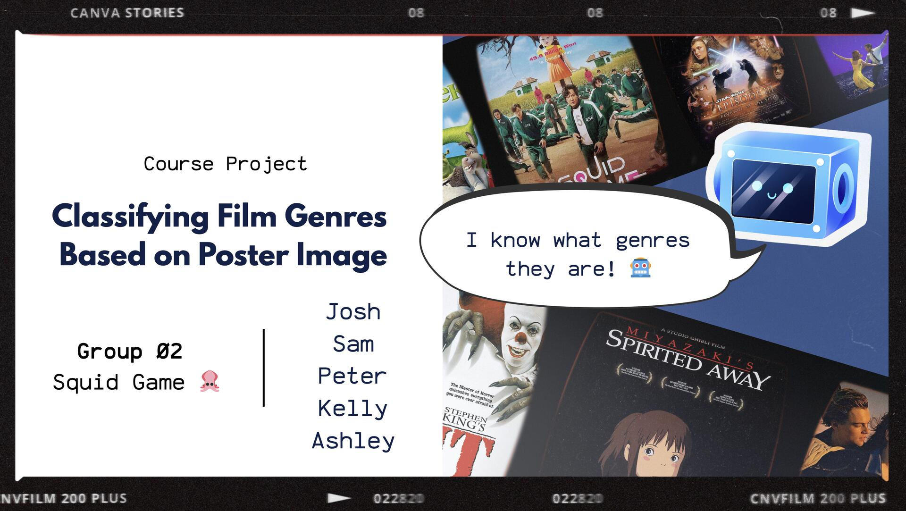
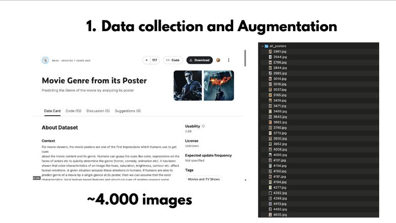
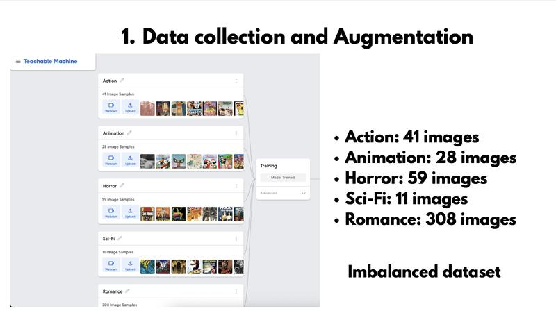
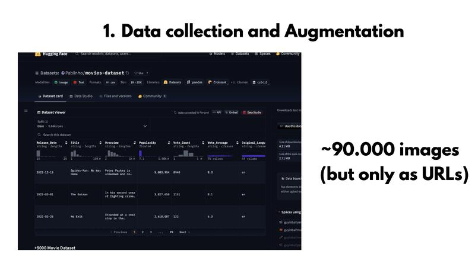
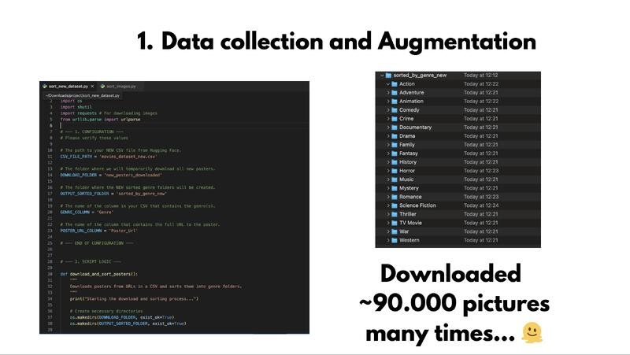
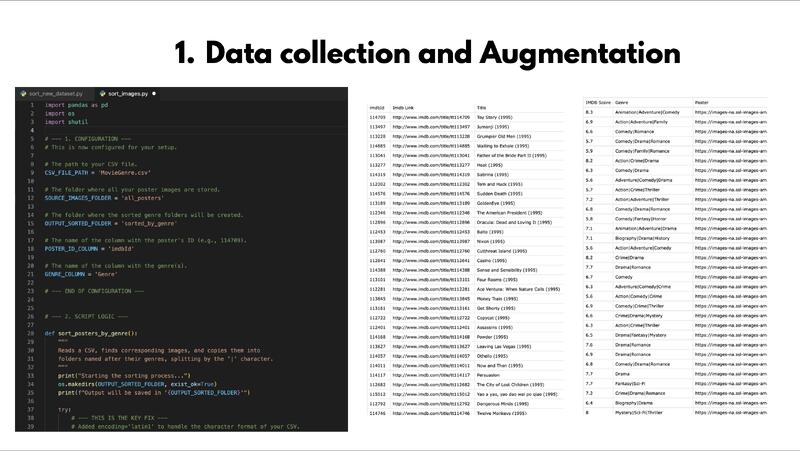
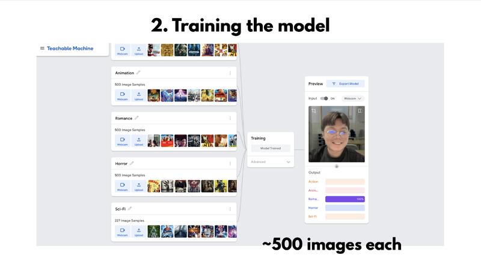

# Multi-Label Film Genre Classifier | KENTECH WFK AI Program

> This is an archive/documentation of the Capstone project I did with my team in the KENTECH WFK AI Program!

A computer vision project to classify film genres from poster images. **1st Place Winner baby** 🏆🕺🏻

## The Problem

Standard movie genre classification often relies on metadata or trailers (just follow the narrative...) We wanted to see if we could predict genres purely from visual poster elements (color schemes, composition, imagery) using computer vision.

**The Data Challenge:** Initial scraping yielded highly imbalanced classes:
- Action: 41 images
- Romance: 308 images  
- Sci-Fi: 11 images

Training on this would create a really biased model that just predicts "Romance" for everything. It even said I looked romantic (wasn't interested 🤚🏻).

## The Solution

### 1. Data Engineering & Balancing

**Discovery phase:** Found the first dataset on Kaggle (~4,000 movie posters), but there was a huge class imbalance.

- Action: 41 images
- Romance: 308 images  
- Sci-Fi: 11 images

**The Fix:** Sourced an alternative larger dataset from Hugging Face (90,000+ image URLs) to make balanced training data.

**Automation:** Wrote Python scripts using pandas and requests to handle the scale (manual sorting would've taken ages 🫩)

### 2. Model Architecture

### 3. Results

- Successfully classified multiple genres (Action, Animation, Horror, Romance, Sci-Fi) from poster imagery alone

## Skills Showed

- **Data Pipeline Engineering:** Python, pandas, requests for large-scale image processing
- **Data Quality & EDA:** Identifying and fixing class imbalance issues
- **Computer Vision:** Transfer learning, MobileNet architecture, multi-label classification
- **Rapid Prototyping:** Delivering working solution under tight deadline (3 weeks) with cross-cultural team

## What I Learned

The biggest lesson was that **real-world data is messy**, and 80% of the work is cleaning and balancing it. The model architecture matters less than feeding it representative data. 

Also learned to build automation early—when you're dealing with 90,000 images, you can't manual-sort your way out of problems.

Yeah. Not the most technically advanced or impressive project, but we had fun doing it. 😄
